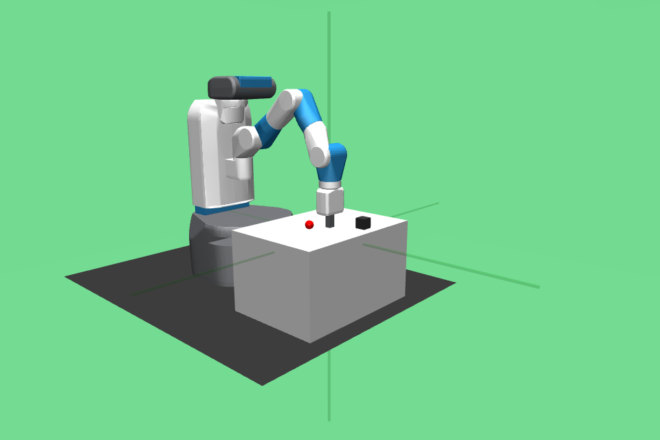
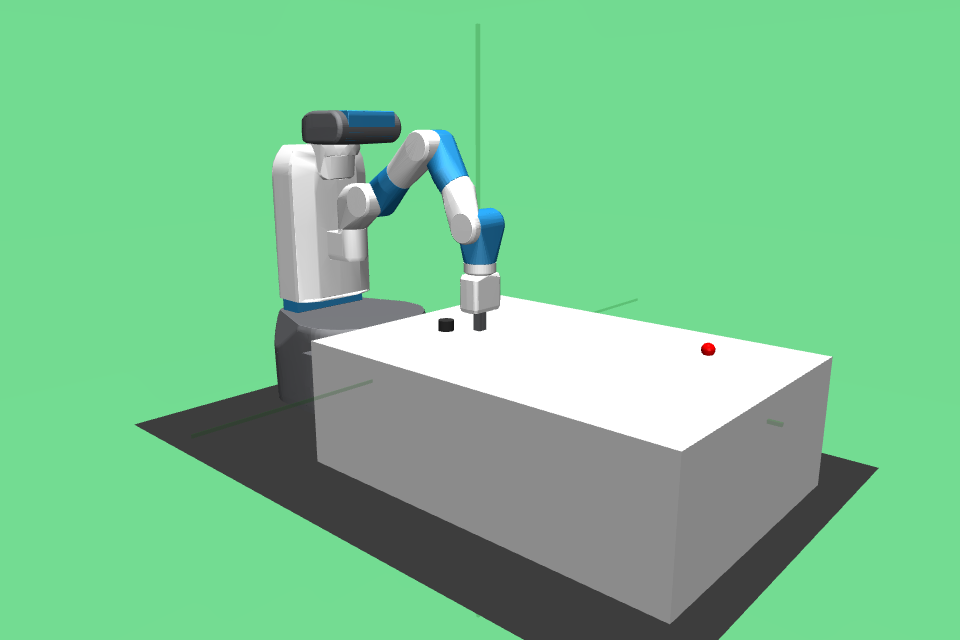
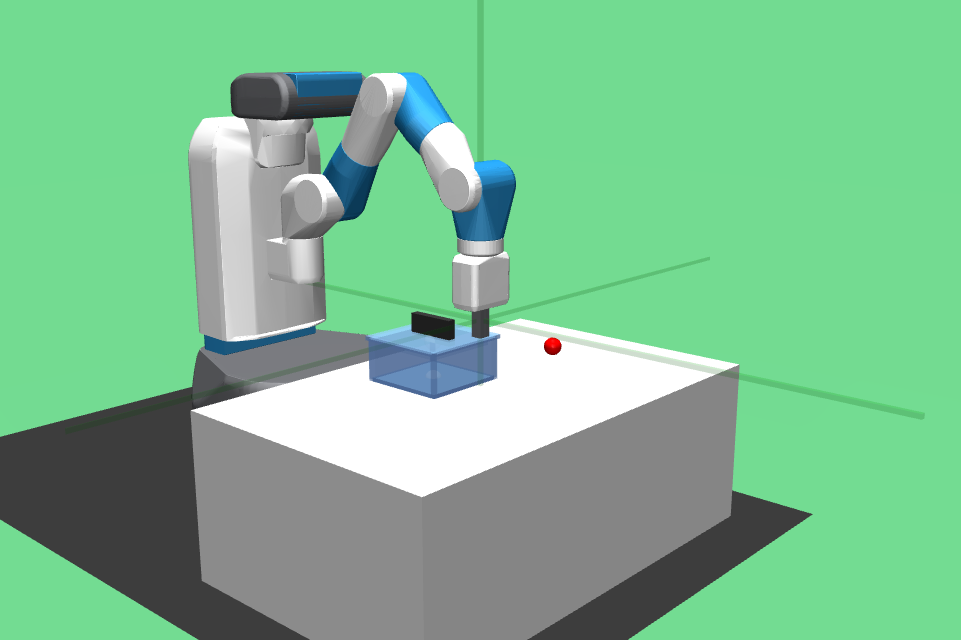
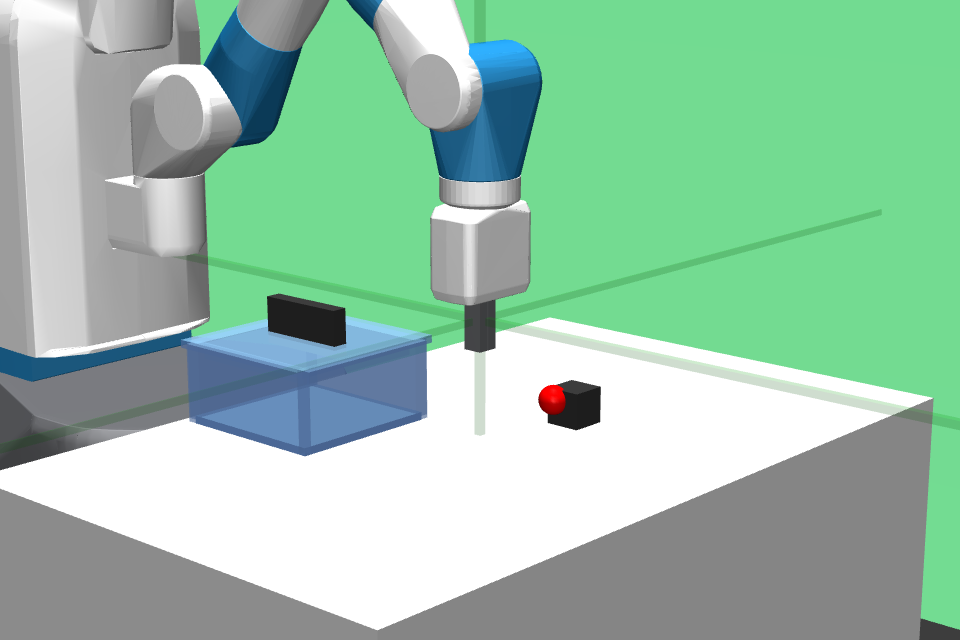
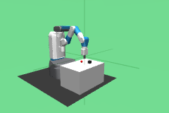
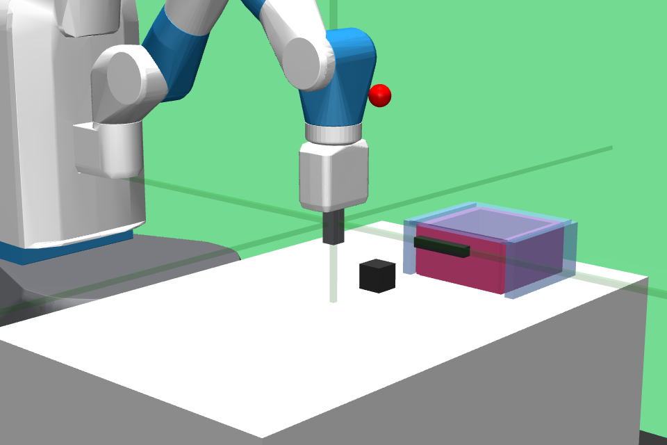
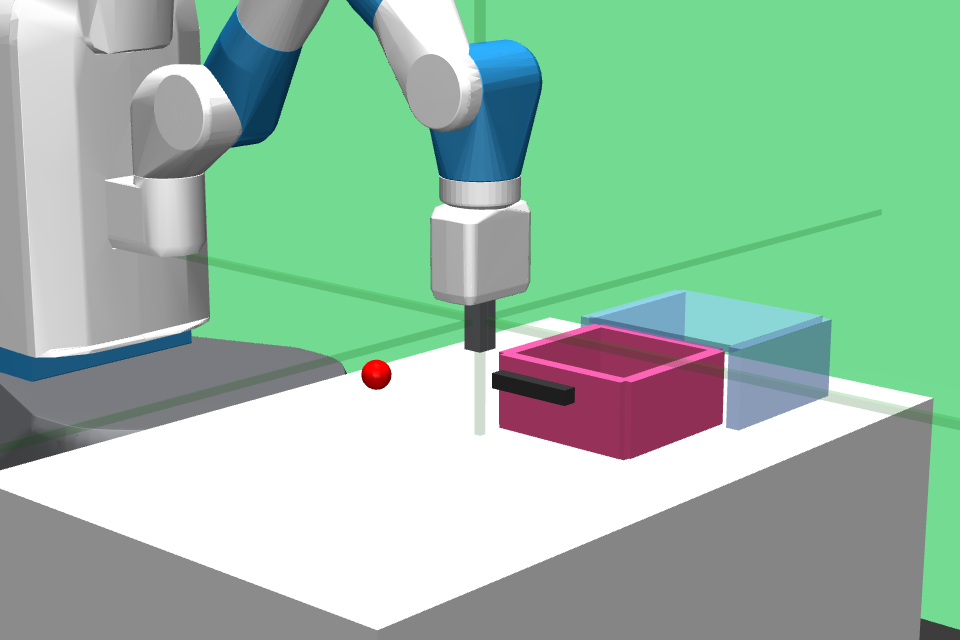

# Extended Taskset for the Fetch Robot

## Lsit of environments

Existing Fetch environments from gym

Reach-v2    | Push-v2    | PickPlace-v2 | Slide-v2    
:----------:|:----------:|:------------:|:--------:
 |  |      |  

Single Task Environments for Primitives

 Name            | Render
---------------- | -------------------------
 Bin-picking-v2  | 📈 In Progress
 Box-open-v2     | 📈 In Progress
 Box-close-v2    | 📈 In Progress
 Drawer-open-v2  | 📈 In Progress
 Drawer-close-v2 | 📈 In Progress

The environments look like the following:

Box-open-v0 | Box-close-v0 | Bin-picking-v0 
----------- | ------------ | --------------
 |  | 
**Drawer-open-v0** | **Drawer-close-v0** | 
 |  |

