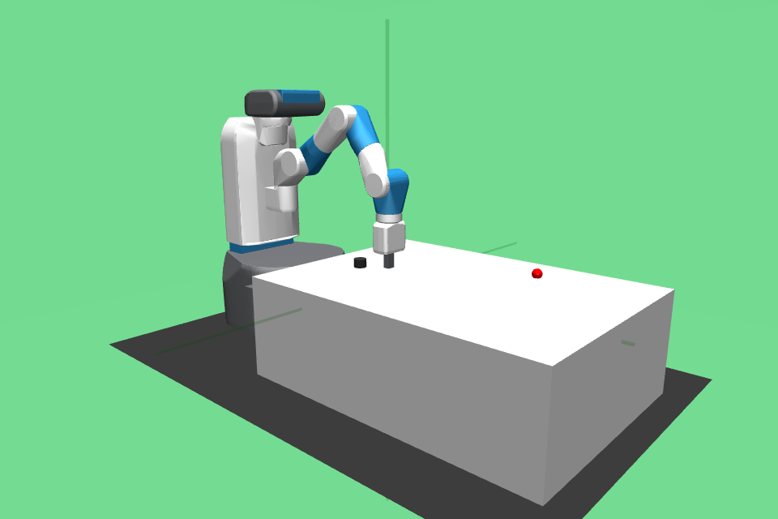
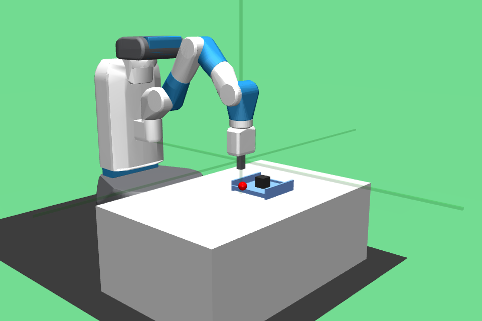
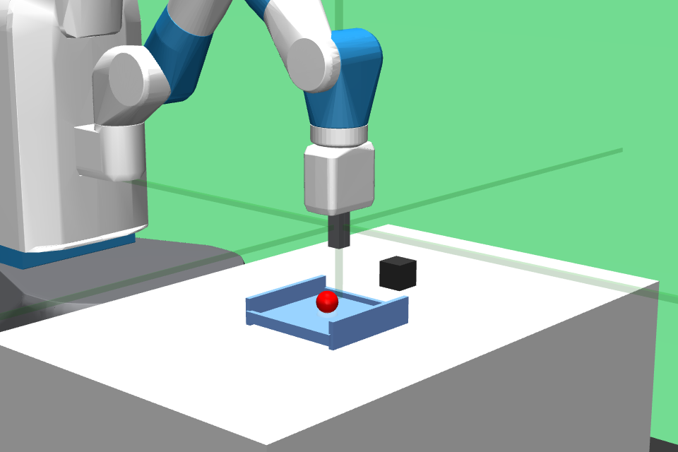
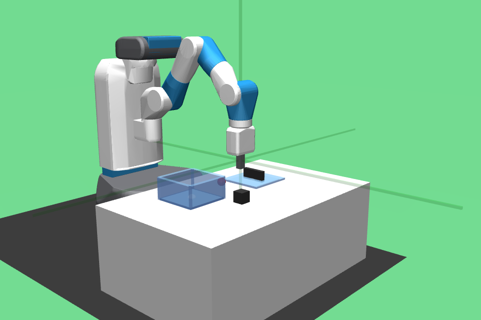
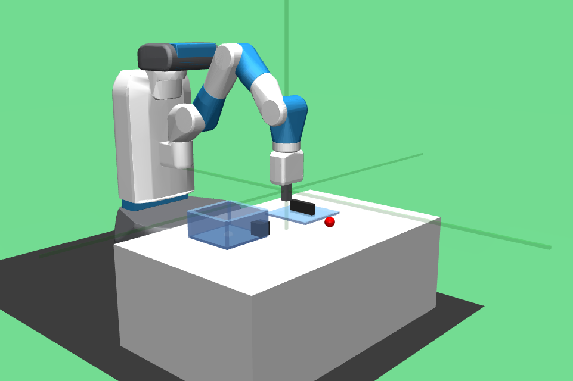
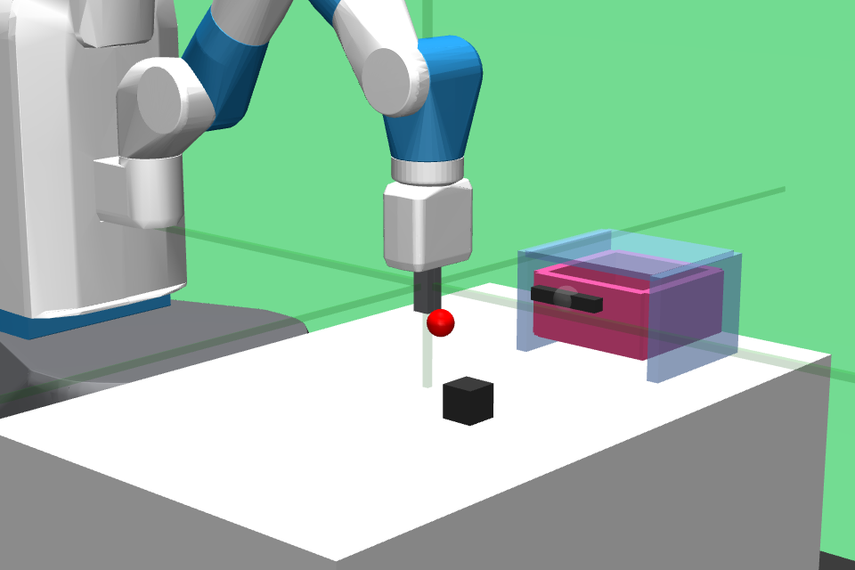
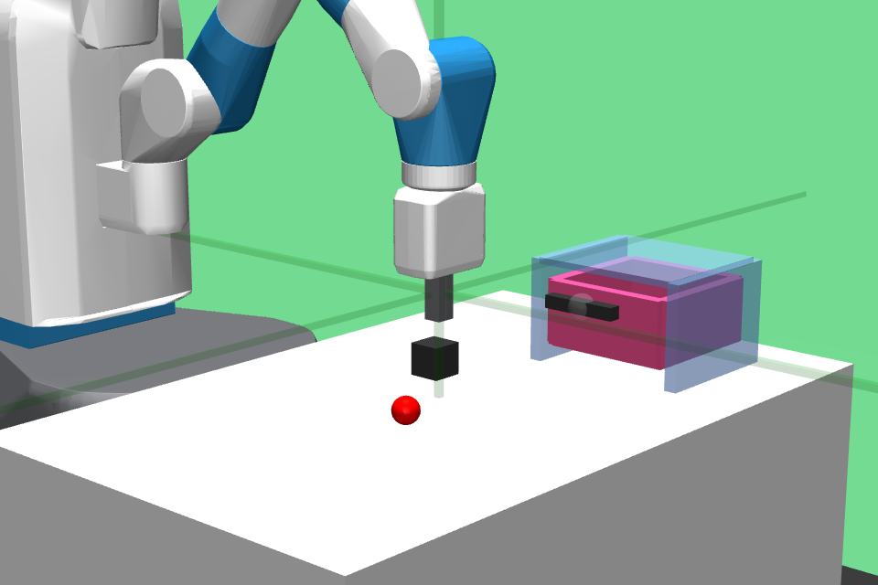
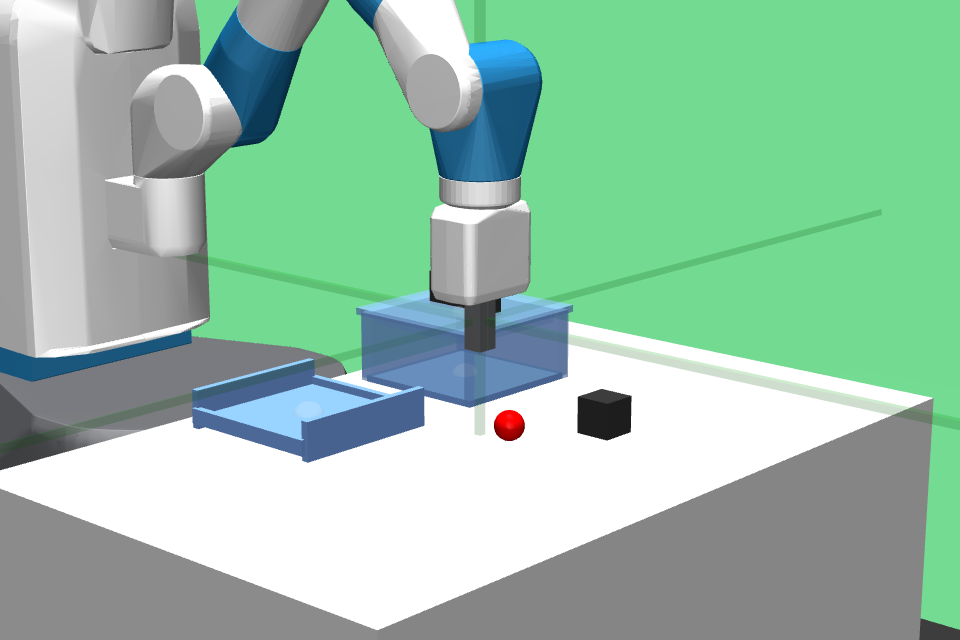

# Extended Taskset for the Fetch Robot

[](https://badge.fury.io/py/gym-fetch)

## Installation

you can do: 

```bash
pip install gym-fetch
```

Alternatively, you can clone this repo and install under development 
mode:
```
git clone <this repo>
cd <this repo>
pip install -e .
```

## Environments

We extend existing Fetch environments from gym, with 7 new manipulation
tasks. The `gym.Fetch` environment are much better engineered than the
sawyer environments that `metaworld` uses. They are faster to initialize,
and have a small (50 step) maximum episode length, making these environments
faster to train on.

> We might or might not need to extend the `max_episode_steps` on more 
> complex tasks.


Reach-v2    | Push-v2    | PickPlace-v2 | Slide-v2    
:----------:|:----------:|:------------:|:--------:
 |  |      |  


# Single Task Environments for Primitives

The tasks involve a single primitive action such as
open/closing a box, or a drawer. They do not additionally
involve placing an object into the opened drawer or box.
We include bin picking and placing because the bin does
not require an additional action to open.

 Name            | Status
---------------- | -------------
 Bin-pick-v2     | ✅ done
 Bin-place-v2    | ✅ done
 Box-open-v2     | ✅ done
 Box-close-v2    | ✅ done
 Drawer-open-v2  | ✅ done
 Drawer-close-v2 | ✅ done

 Box-open-v0 | Box-close-v0 | Bin-pick-v0 | Bin-place-v0
 :---------: | :----------: | :---------: | :----------: 
  |  |  | 
 **Drawer-open-v0** | **Drawer-close-v0** | 
  |  |

# Intermediate Task

These tasks additionally require placing the object
inside an open drawer or box. We include the `Bin-picking` 
environment for completeness.

 Name            | Status
---------------- | --------------
 Bin-pick-v2     | ✅ done
 Bin-place-v2    | ✅ done
 Box-place-v2    | ✅ done
 Box-pick-v2     | ✅ done
 Drawer-place-v2 | ✅ done
 Drawer-pick-v2  | ✅ done

 Bin-pick-v0 | Bin-place-v0 | Box-pick-v0  | Box-place-v0 
 :---------: | :----------: | :----------: | :----------:
  |  |  | 
 **Drawer-pick-v0** | **Drawer-place-v0 ** |
  |  |

# Multi-task Environments

These environments require significantly more memory due
to the increasing complexity of contact detection and 
collision dynamics. These are also slower to run.

  Name            |  Render
 ---------------- | :---------------:
  BoxBin-v2       |  ✅ done
  DrawerBin-v2    |  ✅ done
  BoxBinDrawer-v2 |  ✅ done


  BoxBin-v0        | DrawerBin-v0     | BoxBinDrawer-v0   
:----------------: | :--------------: | :---------------:
 |  | 

