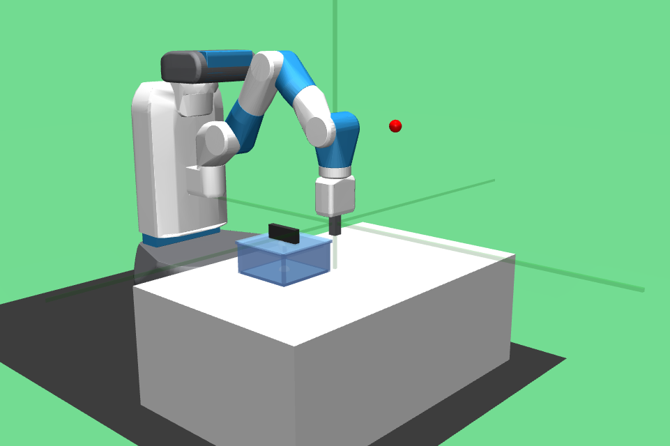
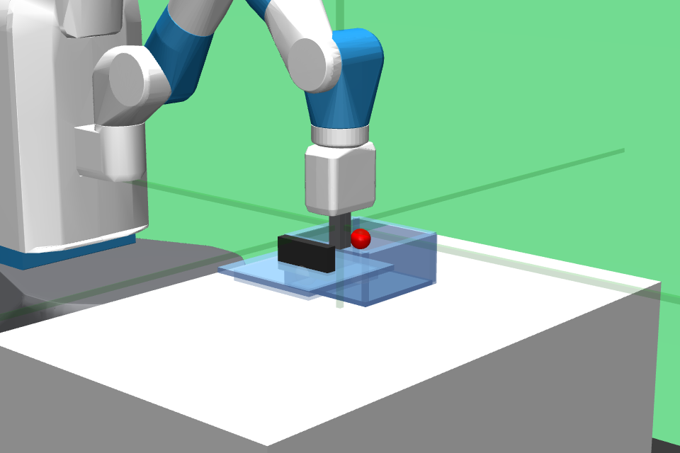
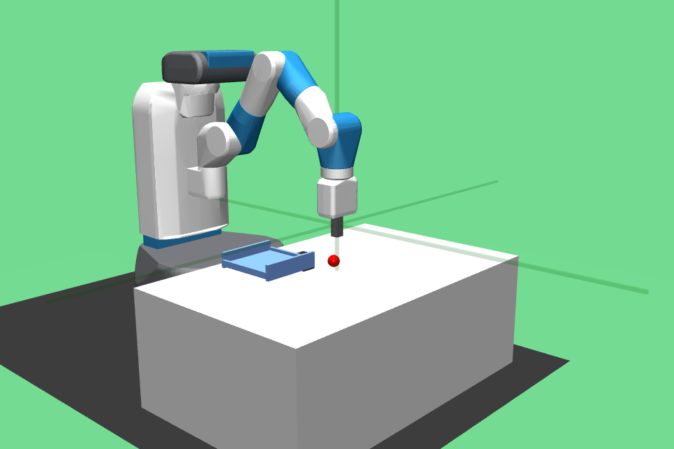
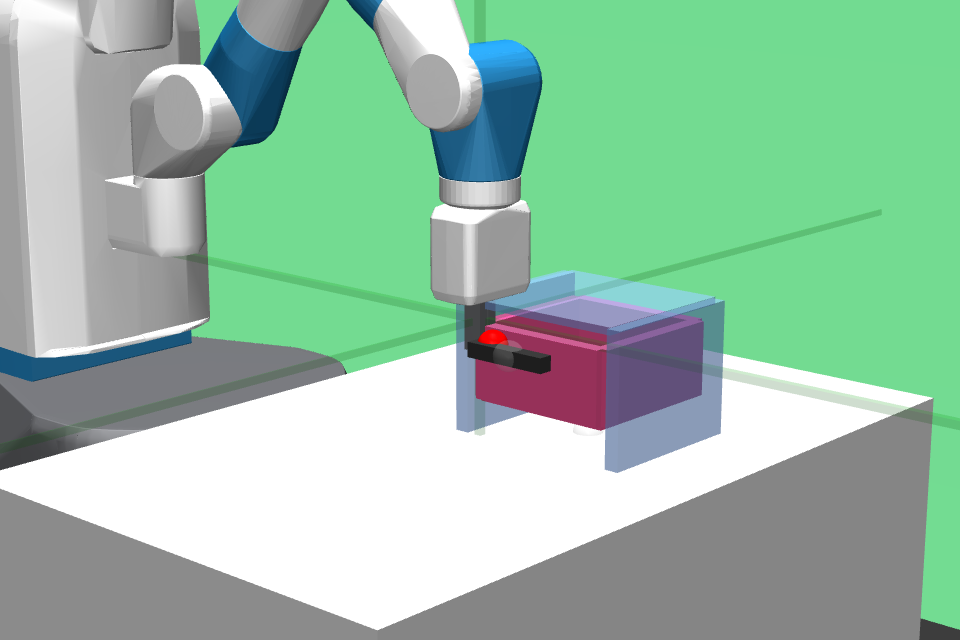
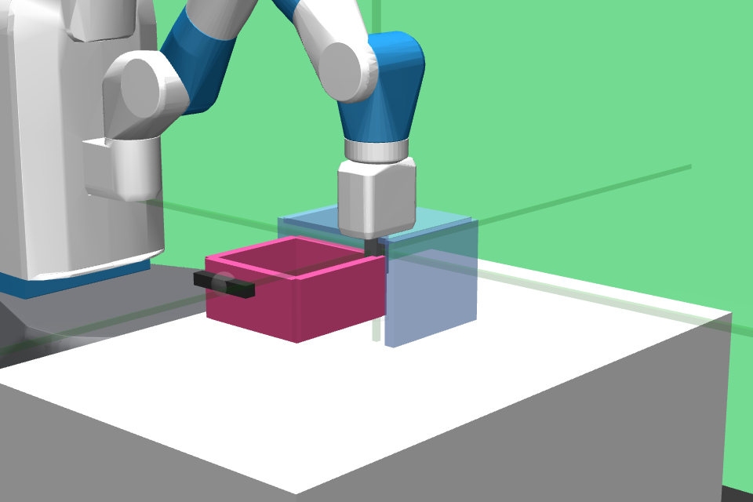
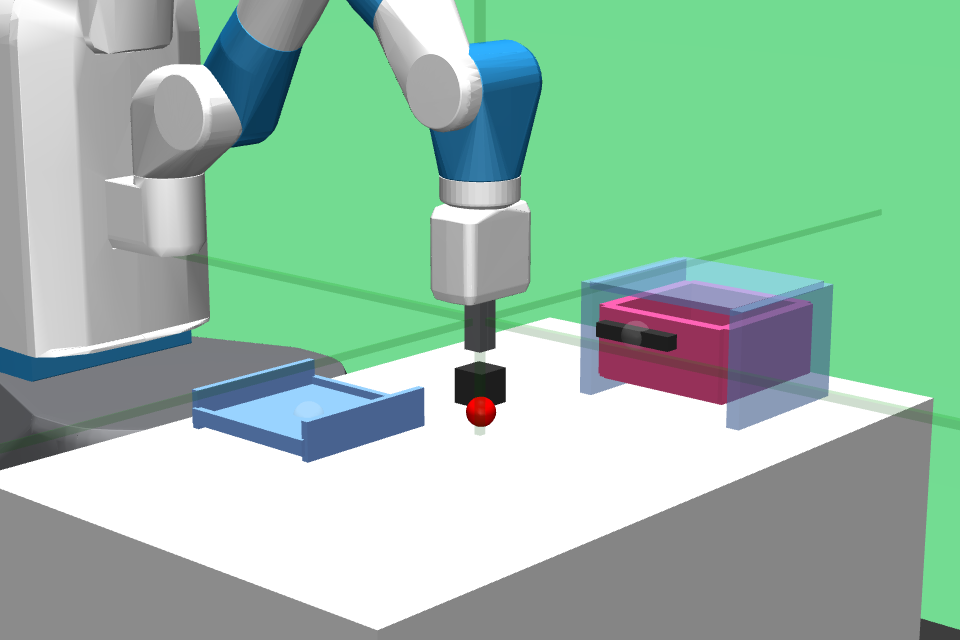
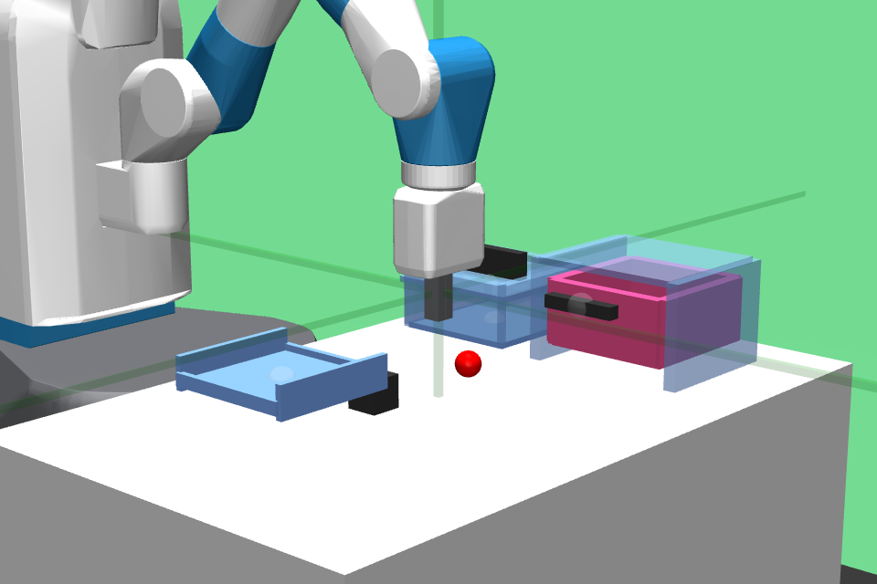

# Extended Taskset for the Fetch Robot

## Installation

you can do: 

```bash
pip install gym-fetch
```

Alternatively, you can do
```
git clone <this repo>
cd <this repo>
pip install -e .
```

## Environments

Existing Fetch environments from gym


Reach-v2    | Push-v2    | PickPlace-v2 | Slide-v2    
:----------:|:----------:|:------------:|:--------:
 |  |      |  


# Single Task Environments for Primitives

 Name            | Status
---------------- | -------------------------
 Bin-picking-v2  | ✅ done
 Box-open-v2     | ✅ done
 Box-close-v2    | ✅ done
 Drawer-open-v2  | ✅ done
 Drawer-close-v2 | ✅ done

The environments look like the following:

 Box-open-v0 | Box-close-v0 | Bin-picking-v0 
 :---------: | :----------: | :------------:
  |  | 
 **Drawer-open-v0** | **Drawer-close-v0** | 
  |  |

# Multi-task Environments

These environments require significantly more memory due
to the increasing complexity of contact detection and 
collision dynamics. These are also slower to run.


  Name            |  Render
 ---------------- | :---------------:
  BoxBin-v2       |  ✅ done
  DrawerBin-v2    |  ✅ done
  BoxBinDrawer-v2 |  ✅ done


  BoxBin-v2        | DrawerBin-v2     | BoxBinDrawer-v2   
:----------------: | :--------------: | :---------------:
 |  | 

