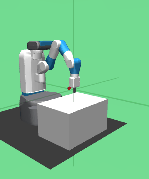
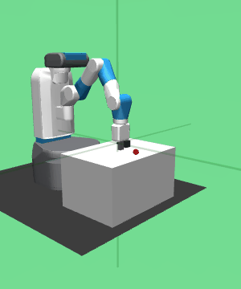

# Original Gym Fetch Tasks

This set reproduces the original gym Fetch robot tasks.

Name             | Observation Spec               | Info
---------------- | ----------------               | -------
**Reach-v0**     | achieved_goal: (3,)<br>desired_goal: (3,)<br>observation: (10,)     | 
**Push-v0**      | achieved_goal: (3,)<br>desired_goal: (3,)<br>observation: (25,)      | 
**PickPlace-v0** | achieved_goal: (3,)<br>desired_goal: (3,)<br>observation: (25,) | 
**Slide-v0**     | achieved_goal: (3,)<br>desired_goal: (3,)<br>observation: (25,)     | 

```python
render_initial('fetch:Reach-v0', row)
render_video('fetch:Reach-v0', 5, row)
```

| **Reach-v0** | **distribution** |   |
|:------------:|:----------------:|:-:|
|  |  |  |
```python
render_initial('fetch:Push-v0', row)
render_video('fetch:Push-v0', 5, row)
```

| **Push-v0** | **distribution** |   |
|:-----------:|:----------------:|:-:|
|  |  |  |
```python
render_initial('fetch:PickPlace-v0', row)
render_video('fetch:PickPlace-v0', 5, row)
```

| **PickPlace-v0** | **distribution** |   |
|:----------------:|:----------------:|:-:|
|  |  |  |
```python
render_initial('fetch:Slide-v0', row)
render_video('fetch:Slide-v0', 5, row)
```

| **Slide-v0** | **distribution** |   |
|:------------:|:----------------:|:-:|
|  |  |  |
