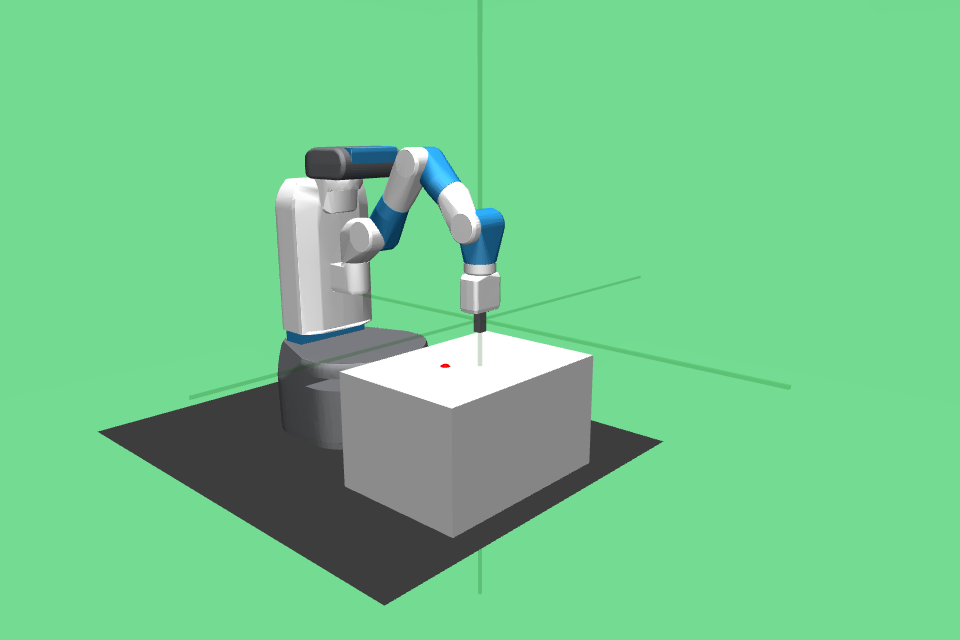
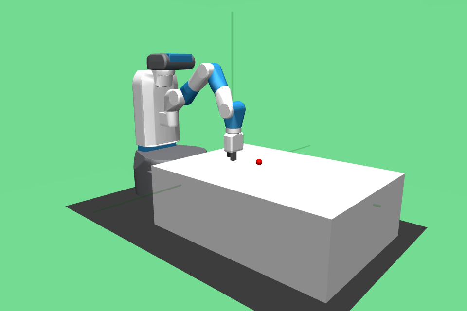

# Details on the observation spaces

## Original Fetch Environments

 Env          | Obs Spec                           | Render
------------- |:----------------------------       | ----------------------
 Reach-v2     | achieved_goal: Box(3,) desired_goal: Box(3,) observation: Box(10,)        | 
 Push-v2      | achieved_goal: Box(3,) desired_goal: Box(3,) observation: Box(25,)         | 
 PickPlace-v2 | achieved_goal: Box(3,) desired_goal: Box(3,) observation: Box(25,) | 
 Slide-v2     | achieved_goal: Box(3,) desired_goal: Box(3,) observation: Box(25,)        |  

## Primitives Single Task Environments

- [ ] `compute_reward`
- [ ] `obs_space`
- [ ] `initial_pos`

 Env             | Obs Spec                              | Render
---------------- |:----------                            |:----------
 Box-open-v0     | achieved_goal: Box(3,) desired_goal: Box(3,) observation: Box(10,)       | 
 Box-close-v0    | achieved_goal: Box(3,) desired_goal: Box(3,) observation: Box(10,)      |   
 Bin-pick-v0     | achieved_goal: Box(3,) desired_goal: Box(3,) observation: Box(25,)       |  
 Bin-place-v0    | achieved_goal: Box(3,) desired_goal: Box(3,) observation: Box(25,)      | 
 Drawer-open-v0  | achieved_goal: Box(3,) desired_goal: Box(3,) observation: Box(10,)    |  
 Drawer-close-v0 | achieved_goal: Box(3,) desired_goal: Box(3,) observation: Box(10,)   |  

## Intermediate Task

These tasks additionally require placing the object
inside an open drawer or box. We include the `Bin-picking` 
environment for completeness.

 Name            | Obs Spec                              | Render
---------------- | :-------------                        | :-------------
 Bin-pick-v0     | achieved_goal: Box(3,) desired_goal: Box(3,) observation: Box(25,)       |   
 Bin-place-v0    | achieved_goal: Box(3,) desired_goal: Box(3,) observation: Box(25,)      |      
 Box-place-v0    | achieved_goal: Box(3,) desired_goal: Box(3,) observation: Box(25,)       |   
 Box-pick-v0     | achieved_goal: Box(3,) desired_goal: Box(3,) observation: Box(25,)      |  
 Drawer-place-v0 | achieved_goal: Box(3,) desired_goal: Box(3,) observation: Box(25,)    |    
 Drawer-pick-v0  | achieved_goal: Box(3,) desired_goal: Box(3,) observation: Box(25,)   |  

## Multi-task Environments

These environments require significantly more memory due
to the increasing complexity of contact detection and 
collision dynamics. These are also slower to run.

 Name            | Obs Spec                               | Render
---------------- | :---------------                       | :---------------
 BoxBin-v0       | achieved_goal: Box(3,) desired_goal: Box(3,) observation: Box(25,)          |  
 DrawerBin-v0    | achieved_goal: Box(3,) desired_goal: Box(3,) observation: Box(25,)       | 
 BoxBinDrawer-v0 | achieved_goal: Box(3,) desired_goal: Box(3,) observation: Box(25,)    | 

